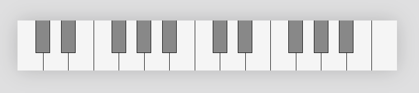
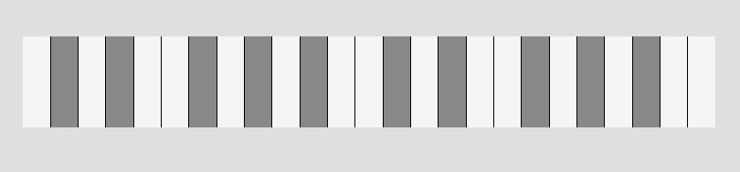
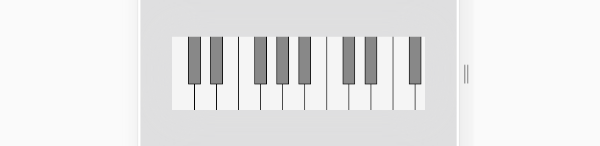
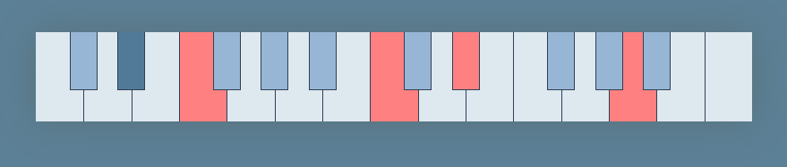

# PianoKeys

> A canvas based piano keyboard.

PianoKeys is a lightweight piano keyboard that can be customized and interacted with the mouse.
Check out the [live demo]().

## Basic usage

Simply insert `piano-keys.js` into your webpage and add a `piano-keys` element to it.
```
<piano-keys start="60" end="84" mode="slide"></piano-keys>
```



## Layouts

PianoKeys comes with two layouts : `classic` and `linear`. While the `classic` layout tries to mimic the classic piano keys layout, the `linear` layout gives the same size to black and white keys.



## Range and keys size

A first approach for setting the range of the keyboard is to specify both `start` and `end` attributes which define the first and the last key to be shown. 
```
<piano-keys start="60" end="84"></piano-keys>
```
Using this approach, the keys will be resized so that they fit the available space within the component.


You can only specify a fixed width in pixels for the keys with `fixed`. If `fixed` has a strictly positive value, then the `end` attribute will be ignored and the component will show as many keys as possible within the available space. 
```
<piano-keys start="60" fixed="50"></piano-keys>
```


## Mouse interaction modes

You can choose between these mouse interaction modes :
- `default`: press the mouse to press a key, release the mouse to release the key.
- `slide`: same as default but you can also slide from a note to another with a mouse drag.
- `toggle`: press the mouse to toggle a key
- `none`: the mouse is simply ignored

## Customize appearence

Out of the box, PianoKeys allow you to specify colors for the keys, accordingly to their state (normal, hovered or pressed). The available attributes are :
- `stroke`
- `whiteKey`
- `whiteKeyHover`
- `whiteKeyOn`
- `blackKey`
- `blackKeyHover`
- `blackKeyOn`

These attributes can be either a color, a gradient or a pattern, as defined in the [Canvas API](https://developer.mozilla.org/fr/docs/Web/API/CanvasRenderingContext2D/fillStyle).


```
<piano-keys start="60" end="84" mode="toggle"
  whitekey="#dee8ef" whitekeyhover="#aaccd9" whitekeyon="#ff8080"
  blackkey="#97b6d5" blackkeyhover="#517a99" blackkeyon="#ff8080">
</piano-keys>
```

For more control over the look, you can also inherit from `PianoKeys` to have your custom drawing code.

## Listening to key events

You can react to key events using standard DOM events. The available events are :
- `keychange`: fired whenever a new key was pressed or a key was released.
- `keyhover`: fired whenever a key was hovered.

```javascript
  const pianoKeys = document.querySelector('#piano-key');

  pianoKeys.addEventListener('keyhover', () => {
    console.log("Mouse is over key", pianoKeys.hoveredKey);
  });

  pianoKeys.addEventListener('keychange', () => {
    console.log("Keys being pressed", pianoKeys.keys.join(', '));
  });
```